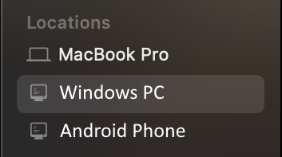
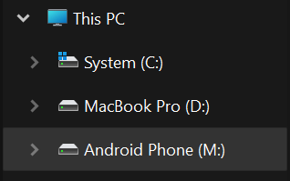

  

<h1 align="center">Hi and welcome! 👋</h1>

  This is the <a href="https://filedonkey.app">FileDonkey</a> app account. 

<h1 align="center">FileDonkey: Your Devices, One Filesystem</h1>

  
  

FileDonkey transforms how you access files across devices. This lightweight utility creates a virtual disk that seamlessly mirrors the file systems of all your connected devices on the same local network.
 
 
<h3 align="center">
  <a href="https://filedonkey.app">Be the first to know when FileDonkey launches</a>
</h3>
 
<h3 align="center">✔️ Key Features:</h3>

📱 Instant file access between Android, iPhone, Mac, Windows, and Linux devices

⚡ Zero configuration setup — just install and use

🔌 No more tangled wires or complicated network configurations

🔒 No cloud storage required — everything goes through your local network and stays on your devices

🔄 Real-time file synchronization without manual transfers

🖱️ Drag-and-drop simplicity with native file explorer integration

 

Native integration with Finder in macOS

   

 

Native integration with File Explorer in Windows

   

 
Stop emailing files to yourself or juggling USB drives. FileDonkey creates a unified filesystem across all your devices, making your important files instantly accessible wherever you need them.
 
 
 

<h3 align="center">📋 License</h3>

<strong>FileDonkey is dual-licensed:</strong>

<ul>
  <li>Free Non-Commercial: <a href="https://github.com/filedonkey/filedonkey/blob/master/LICENSE-NONCOMMERCIAL">CC BY-NC 4.0</a></li>
  <li>Commercial: <a href="https://github.com/filedonkey/filedonkey/blob/master/LICENSE-COMMERCIAL">Contact for details</a></li>
  <li>Full License Info: <a href="https://github.com/filedonkey/filedonkey/blob/master/LICENSE">LICENSE</a></li>
</ul>

<strong>Business Structure:</strong> Sole Proprietorship (not a registered company)

Copyright © 2025 Ihor Horemykin. All rights reserved.

Unauthorized commercial use is a violation of copyright law and will be enforced.

 

<h3 align="center">
  <a href="https://filedonkey.app">https://filedonkey.app</a>
</h3>
